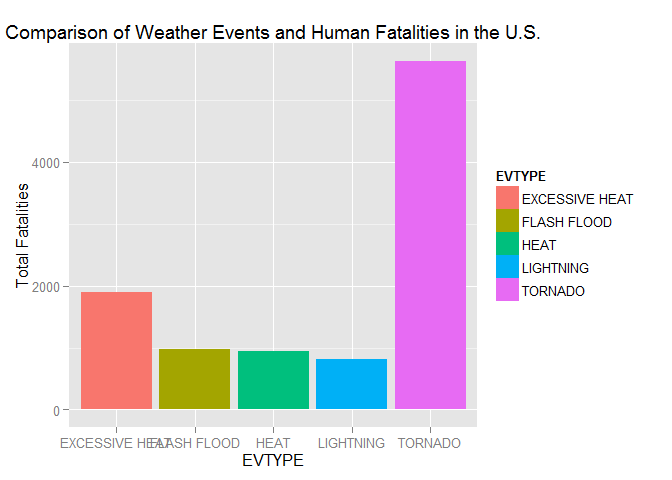
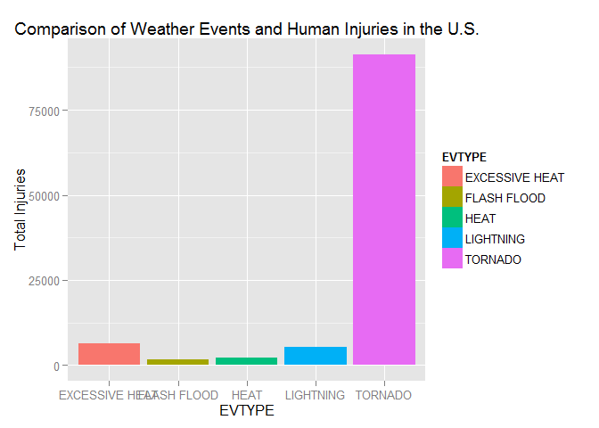
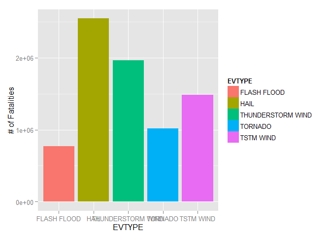

# Consequences of Major Storms and Weather Events in the U.S
Brad Tweardy  
Thursday, March 12, 2015  

Synopsis
================================================================================
In this analysis, we will review the NOAA storm database which tracks 
characterstics of major storms and weather events in the United States from 1950 
through November 2011. We will look specifically at two scenarios:

1. Across the United States, which types of events (as indicated in the EVTYPE 
variable) are most harmful with respect to population health?

2. Across the United States, which types of events have the greatest economic 
consequences?

This analysis will describe how we get the data, what data is used and what the 
results are.


Data Processing
================================================================================
First we have loaded the database into the system using the following R code:


```r
stormdata <- read.csv("Reproducible\\repdata-data-stormdata.csv.bz2", header = 
                              TRUE)
```

Now that we have the data loaded let's look at our two scenarios and how we will
process the data to analyze them.

*Scenario 1:*
In analyzing this scenario, we will take the NOAA data and create a new data set 
that ranks each type of storm/weather event (as descibed by "EVTYPE") by two 
factors two: fatalities and injuries. We will use this data to create a bar plot 
that provides a visual comparison of the top five results with the largest impact. 


```r
library(dplyr)
library(ggplot2)
pop_healthstats <- stormdata %>%
        group_by(EVTYPE)%>%
        summarise(fatal = sum(FATALITIES), Injury = sum(INJURIES))%>%
        arrange(desc(fatal, Injury))        
danger <- head(pop_healthstats, 5)
danger
```

```
## Source: local data frame [5 x 3]
## 
##           EVTYPE fatal Injury
## 1        TORNADO  5633  91346
## 2 EXCESSIVE HEAT  1903   6525
## 3    FLASH FLOOD   978   1777
## 4           HEAT   937   2100
## 5      LIGHTNING   816   5230
```

```r
qplot(main = "Comparison of Weather Events and Human Fatalities in the U.S.", 
      x = EVTYPE, ylab = "Total Fatalities", data = danger, weight = fatal, fill 
      = EVTYPE)
```

 

```r
qplot(main = "Comparison of Weather Events and Human Injuries in the U.S.", 
      x = EVTYPE, ylab = "Total Injuries", data = danger, weight = Injury, fill 
      = EVTYPE)
```

 


*Scenario 2:*
In analyzing scenario 2, we will again take the NOAA data and create a new data 
set that ranks each type of storm/weather event (as descibed by "EVTYPE") by the 
two factors: property expenses and crop expenses. We will use this data to create 
a bar plot that provides a visual comparison of the top five results with the 
largest impact.


```r
econ_impact <- stormdata %>%
                group_by(EVTYPE) %>%
                summarise(propdmg = sum(PROPDMGEXP), cropdmg = sum(CROPDMGEXP))%>%
                mutate(impact = propdmg + cropdmg)%>%
                arrange(desc(impact))
expensive <- head(econ_impact, 5)
expensive
```

```
## Source: local data frame [5 x 4]
## 
##              EVTYPE propdmg cropdmg  impact
## 1              HAIL 1762050  783612 2545662
## 2 THUNDERSTORM WIND 1394171  571255 1965426
## 3         TSTM WIND 1226522  259824 1486346
## 4           TORNADO  898934  118390 1017324
## 5       FLASH FLOOD  584451  184713  769164
```

```r
qplot(x = EVTYPE, ylab = "# of Fatalities", data = expensive, weight = impact, 
      fill = EVTYPE)
```

 


Results
================================================================================
In conclusion, we clearly see that Tornadoes have caused the most impact on the 
human population in the U.S. with regards to both injuries and fatalities.

Conversely, when we look at the same set of data, Hail proves to have the greatest financial impact on the U.S.
